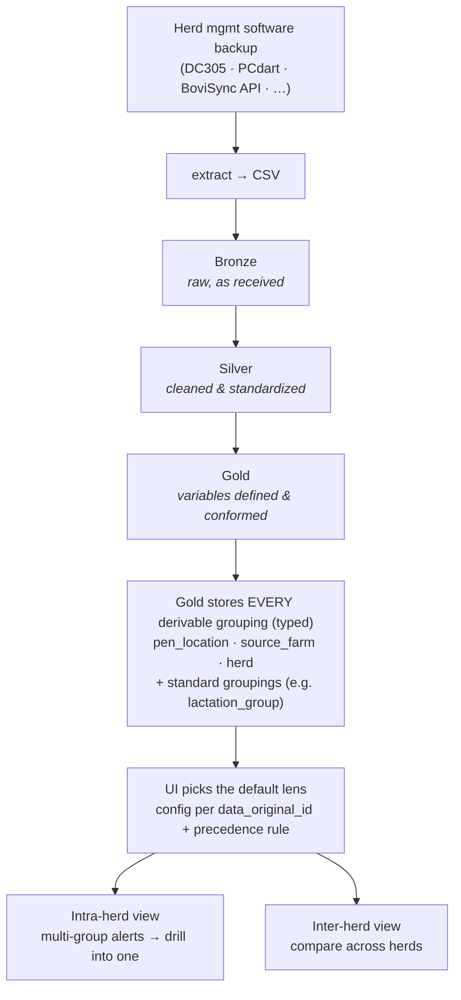

# Gold Data Pipeline — Design Notes

**Status:** design / brainstorm phase (structure-first; not implementation yet)
**Scope of this doc:** acquisition → wrangle → storage, producing **"gold"-level parquet** that reporting is later built on. Reporting itself is out of scope here.

> This is the **shared, async source of truth** for the pipeline design. If you change a
> decision or close an open question, edit this file and commit it. Add a dated line under
> **Decision log** so others can follow the reasoning. No credentials, hostnames, account
> names, or other environment-specific secrets in this file — it lives in a public repo.

---

## The flow

---

## Decisions settled

- **Analytical engine = a query engine over parquet in blob** (DuckDB / Arrow-style), *not*
  the operational (OLTP) SQL source. The SQL system is an acquisition **source** only.
- **Layering = medallion**: bronze → silver → gold, all parquet in blob storage.
- **Identity = `data_original_id`**: the stable, atomic identity of a source entity's data,
  consistent over time. It is the longitudinal key (no separate herd key needed).
  Hierarchy: `data_original_id › animal_group (typed) / location › animal`.
- **Acquisition is multi-source and pluggable.** Sources include file-based backups
  (DC305, PCdart) and APIs (BoviSync), with more to come. Each source gets its own
  **ingestion adapter** that lands it into a common bronze/silver shape; everything from
  silver onward is source-agnostic. A `source_system` attribute travels with the data.
- **`animal_group` is a polymorphic / typed dimension**, backed by `pen_location`,
  `source_farm`, or `herd` (= `data_original_id`). It is defined by rules over source
  columns, keyed by `data_original_id`. Cardinality per source varies (1..many groups).
- **Core principle:** **Gold stores every grouping it can derive** (as typed memberships)
  for each animal. The **default reporting lens** is chosen by **config (per
  `data_original_id`) + a precedence rule** (`source_farm` → `pen_location` → `herd`; only
  fall back to `herd` when no finer grouping exists). Do **not** bake "choose one grouping"
  into the data model — unused groupings stay in gold, so switching the lens needs no
  reprocessing.
- **Reporting (downstream, parked):** the front end reduces to **two scopes** — *intra-herd*
  (multi-group alerts, drill into one) and *inter-herd* (compare across herds).
  `animal_group` is the fundamental unit of reporting and user access.

---

## Canonical glossary

New, deliberate names; map to existing/legacy variable names at implementation time.

| Name | Meaning |
|---|---|
| `data_original_id` | Stable, atomic identity of a source entity's data; container of groups/locations/animals. |
| `source_system` | Which herd-management system the data came from (e.g. `dc305`, `pcdart`, `bovisync`). Drives the adapter and some rules. |
| `animal_group_type` | What backs a group: `pen_location` \| `source_farm` \| `herd` \| … |
| `animal_group_id` | Stable key of a group within its type. |
| `animal_group_label` | Display name of a group. |
| `lactation_group` (+ other standard dairy groupings) | Conformed gold dimensions applied consistently across all sources. |

---

## Open questions (checklist)

| # | Topic | Status |
|---|---|---|
| 1 | Acquisition front doors | ✅ multi-source HMS (files + APIs) |
| 2 | Entity identity / keys | ✅ `data_original_id` |
| 3 | Layering — **where does bronze begin?** original backup (replayable) vs the CSV | ⛔ OPEN |
| 4 | Where transforms run | leaning parquet + query engine; specifics open |
| 5 | **Grain** — finest level gold keeps (animal-event vs animal-lactation vs animal_group×period; likely layered) | ⛔ OPEN (next) |
| 6 | Storage layout | parquet ✅, partition by `data_original_id` ✅; **naming convention OPEN** |
| 7 | Cadence & trigger | ⛔ OPEN (batch vs event-driven; full vs incremental) |
| 8 | Contract & lineage | ⛔ OPEN (gold schema contract, manifest, versioning, validation) |
| 9 | Runtime & orchestration | ⛔ OPEN |
| 10 | Conformance registry — are `animal_group`/adapter rules a small reusable config set or bespoke per source? | ⛔ OPEN |

---

## Where we stopped / pick up here

Iterating on the flow above. **Next decisions to tackle: #5 (grain), then #3 (where bronze begins).**

## Decision log

- _(add dated entries here as decisions are made, e.g. `2026-06-24 — settled #5 grain: …`)_
